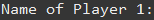
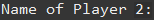
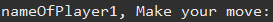
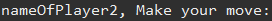

<h4 align="center"> 
	🚧  TicTacToe  under construction...  🚧
</h4>

# 
<strong>TicTacToe Project in Java</strong>

The project was developed to apply Java basics contents that i've been learning during the journey to become a Java developer

## <strong>Contents of the Project</strong>

At this moment, the project contains five classes.
 - Players
 - Pieces
 - GameBoard
 - Logic
 - Game (***with main method***)

 ## <strong>How this code works</strong>
 
 ### Class <strong>Players</strong>

This class was create to apply the methods Gatters and Setters. In this project is used to set a player name, also to call a name of player to make the respective move.

Example:

At first, asking the name of the players.

  

  

The users will put their respectives names, and will be saved in <i>Set</i> method. So we can call them back using the <i>Get</i> method, when it's time to make the respectives moves. As we can see below.

  

  

 ### Class <strong>Pieces</strong>
 

At this moment, the respective class has the objetive to set a piece for each player. Initially, the first player will play with "x" and the second player will play with "o".

In this class, we have two methods <i>Getters</i>, thats returns the piece of respective player.

<h4 align="center"> 
	🚧  In future this class will randomly choose the piece for Players  🚧
</h4>

 
 
