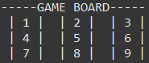

<h1 align="center"><strong> TicTacToe Project in Java</strong></h1>

The project was developed to apply Java basics contents that i've been learning during the journey to become a Java developer

## <strong>Contents of the Project</strong>

At this moment, the project contains five classes.
 - Players
 - Pieces
 - GameBoard
 - Logic
 - Game (***with main method***)

 ## <strong>How this code works</strong>
 
 ### Class <strong>Players</strong>

This class is used to set a player name, also to call a name of player to make the respective move.

Example:

At first, asking the name of the players.

The names will be saved. So we can call them back using the <i>Get</i> method, when it's time to make the respectives moves. As we can see below.

  

  

 ### Class <strong>Pieces</strong>
 

At this moment, the respective class has the objetive to set a piece 'x' for the first player and 'o' for second player. The first player will be drawn in main method.

 ### Class <strong>GameBoard</strong>
  

This class is used to show the GameBoard. 

Initially we have the game board, with all positions that could be chosen. As shown below.

  

We get the player move, and using a switch case statement the move is verify and applied to respective position in the matrix.

 ### Class <strong>Logic</strong>
 

This class is responsible for win check. We take all the eight possibilities of win, and we call the verification method for each new move.

 ### Class <strong>Game</strong>
 

The main method contains all instances of the project classes.

<ul>
<li>
We have a condition to solve who will be the first player using the function Math.random().
</li>
</ul>

The class contains a while loop, responsible to run the code until the condition of victory is satisfied. Inside the while loop we have:

<ul>
<li>
A set that contains the moves already perfomed. 
</li>
<li>
A condition to valid the move
</li>
<li>
A while loop to ask the move until it is valid
</li>
</ul>

And the end we have the print of the gameboard with the result, a victory ou a draw.

 
 
